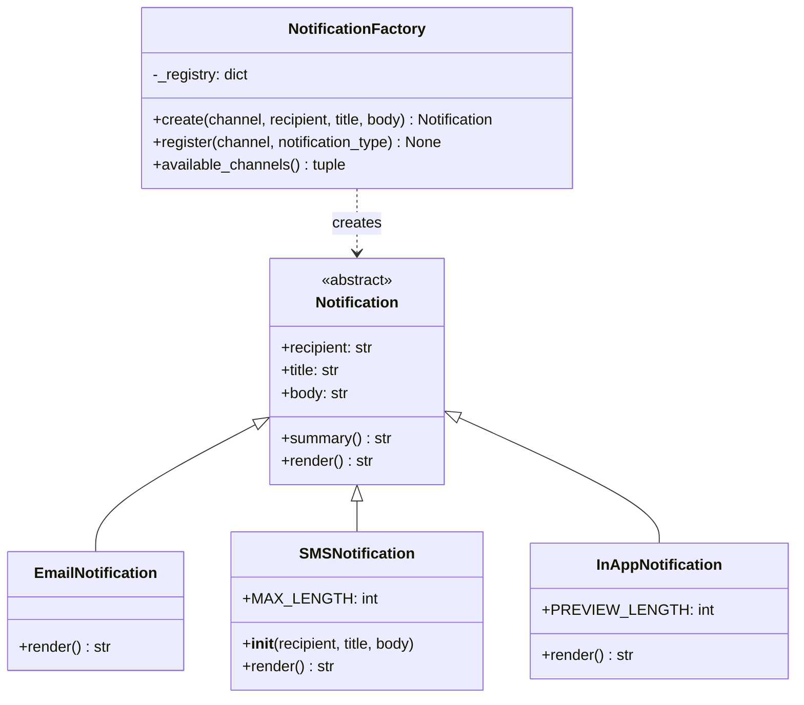

# COMP 271: Assignment 4, A Campus Notification Factory

## Context

A campus application sends announcements through several channels. An email can show a subject and a full message; a text message needs to be brief; an in-app notification can show a short preview. The application should be able to prepare all three without having separate handling code everywhere it uses notifications.

**Design patterns** are reusable approaches to common software design problems. They describe how parts of a program can work together; they are not ready-made code to copy. This assignment introduces a simple example of the **Factory design pattern**: a factory centralizes the decision about which kind of object to create for a requested channel.

You will build the notification objects and their factory. **No prior knowledge of design patterns is needed to complete this assignment.** The requirements below introduce the idea and specify what the program should do, while leaving the implementation to you.

**Scope:** Prepare and display notifications locally. Do not send email, SMS, or push notifications, and do not use external services.

**Allowed imports:** `abc` and `inspect` only. No other imports are permitted for this assignment.

## Learning goals

- Use an abstract base class to specify a common operation and share state and behavior.
- Extend a class with `super()` where a subclass needs extra initialization, and override a method in each subclass.
- Use polymorphism to handle different notification objects through one interface.
- Use a class variable for a registry shared by the factory, and class methods to access it.

## Scenario and common data

Every notification has a `recipient` (a nonempty string), a `title` (a nonempty string), and a `body` (a nonempty string). A notification can be **rendered** as text for its channel. The exact layout is your choice, subject to the channel requirements below. This is a simulation: rendering a notification does not deliver it.

The three channels are `"email"`, `"sms"`, and `"in_app"`. Use these exact keys when selecting a channel.

## Part A: The notification hierarchy

Define an abstract base class `Notification` using Python's `abc` module.

- Its constructor stores and validates the three common fields. Raise `ValueError` when a field is empty or contains only whitespace.
- Provide read access to the fields through properties. Subclasses should use these properties rather than depend on how the parent stores the data.
- Define an abstract `render() -> str` method. A generic `Notification` cannot decide on a channel-specific layout, so `Notification` itself must not be instantiable.
- Define a concrete `summary() -> str` method shared by all notifications. It should return a short string containing the recipient and title. It must not call `render()`: a summary should depend only on the common data, not on any channel's layout.

Then define three concrete subclasses. Each one implements `render()`:

1. `EmailNotification`: include a **To** line, a **Subject** line, and the full body.
2. `SMSNotification`: render exactly `title + ": " + body`. The recipient is not part of the rendered message. An SMS has an extra rule the other channels do not have: the message must be a single line of at most **160 characters**. Enforce this rule **when the object is created**, so that an invalid SMS object can never exist:
   - Define `__init__()` in `SMSNotification`. Call `super().__init__(...)` first so that `Notification` validates and stores the common fields.
   - Then, using the properties, raise `ValueError` if the title or body contains a newline (`"\n"`) or if `title + ": " + body` would exceed 160 characters. Do not truncate the message.
3. `InAppNotification`: include the recipient, the title, and a preview consisting of at most the **first 40 characters** of the body. If the body is longer than 40 characters, append `...` to the preview.

All subclasses should use the common state initialized by `Notification`. Do not duplicate the parent's validation in any subclass. `EmailNotification` and `InAppNotification` add no state and no extra rules, so think carefully about whether they need their own `__init__()` at all (recall `SchoolFriend` inheriting `Friend.__init__()` in lecture).

The numbers 160 and 40 are part of the channel rules, so store them as named constants (for example, `MAX_LENGTH` in `SMSNotification`) rather than writing them as magic values.

## Part B: The factory

Define a class `NotificationFactory` that selects and creates notification objects.

### The registry

The factory's class variable `_registry` is a **dictionary**: it associates each channel name (a string *key*) with a notification class (its *value*). We have not formally studied dictionaries yet, so here is what you need:

```python
# Place this class variable inside NotificationFactory, after defining
# EmailNotification and SMSNotification.
_registry: dict[str, type[Notification]] = {
    "email": EmailNotification,
    "sms": SMSNotification,
}
```

The braces create a dictionary. The colon separates each key from its value. `dict[str, type[Notification]]` says that keys are strings and values are classes that produce `Notification` objects. The values above are **classes**, written without parentheses; `EmailNotification(...)` would create an *instance* instead.

**A class is itself an object in Python.** If you retrieve a class from the registry, you can call it with the common constructor arguments to create an instance. Think about the difference between storing `EmailNotification` and storing `EmailNotification(...)`.

Inside a class method, the registry is reached through `cls._registry`. These are the operations you will need:

| Operation | Meaning |
|---|---|
| `channel in cls._registry` | Check whether a key already exists. |
| `cls._registry[channel]` | Retrieve the class stored under a key; an absent key raises `KeyError`. |
| `cls._registry[channel] = notification_type` | Add a key and its class, or replace an existing value. Check for duplicates first. |
| `cls._registry.keys()` | View the keys, which you can sort and convert to a tuple for `available_channels()`. |

### The class methods

All three factory methods are **class methods**, decorated with `@classmethod`. As in lecture, Python passes the class automatically as `cls`, so a caller writes `NotificationFactory.available_channels()` without passing anything for `cls`.

- `create(cls, channel: str, recipient: str, title: str, body: str) -> Notification`: create and return an instance of the registered class for `channel`. Raise `ValueError` for an unknown channel (check for the key; do not rely on `KeyError`). Let validation errors from the notification constructor propagate to the caller.
- `register(cls, channel: str, notification_type: type[Notification]) -> None`: add a new channel to the shared registry. Raise `ValueError` if:
  - `channel` is empty or contains only whitespace;
  - `channel` is already registered;
  - `notification_type` is not a class (use `inspect.isclass()`);
  - `notification_type` is not a subclass of `Notification` (use `issubclass()`);
  - `notification_type` is abstract (use `inspect.isabstract()`).

  Check that the value is a class **before** calling `issubclass()`, because `issubclass()` raises `TypeError` when given something that is not a class, such as an instance.
- `available_channels(cls) -> tuple[str, ...]`: return the registered channel keys as a tuple, sorted alphabetically. Do not return the mutable registry itself.

The parameter `notification_type` in `register()` is also a class, but it has a different role from `cls`: it is the notification class the caller wants to add. For example, `NotificationFactory.register("in_app", InAppNotification)` passes the class `InAppNotification`, not an instance `InAppNotification(...)`. The annotation expresses the intended input type; your method must still check invalid inputs at runtime.

`InAppNotification` is **not** in the initial registry. It is added by calling `register()`, and the starter `main()` in Part C already makes that call. **Do not register `"in_app"` anywhere else** (not in the initial dictionary, and not at module level): a second registration is a duplicate and must raise `ValueError`. Adding a channel without editing `create()` is exactly what the factory is designed to allow.

The registry is a **class variable**: registration changes the mapping shared by the factory, not the state of an individual notification. You do not need to restrict the number of `NotificationFactory` instances or implement the Singleton pattern.

## UML class diagram

The diagram shows the intended class relationships and public structure; you still need to decide how to implement each method.

The open triangle points from each specialized notification to its parent. `NotificationFactory` creates objects whose shared type is `Notification`; its registry stores notification *classes*. In `Notification`, `render()` is abstract. All members of `NotificationFactory` belong to the class itself: `_registry` is a class variable and the three methods are class methods.



## Part C: Use the system

Write a `main()` function **below your class definitions** in `notification_factory.py` that runs a short scenario: it uses the factory as client code would, shows that every channel works, and shows that each invalid request raises the specified exception. The starter below shows how client code is meant to use your classes: it asks the factory for channels, registers the in-app channel, creates a notification by channel name, and uses it only through the `Notification` interface. It also shows how to **catch** an exception so the scenario keeps running. Copy it, then complete the three `TODO` sections.

```python
def main() -> None:
    """Run a scenario that uses the notification factory."""
    # The factory reports its channels; "in_app" is added by registration.
    print("Before registration:", NotificationFactory.available_channels())
    NotificationFactory.register("in_app", InAppNotification)
    print("After registration:", NotificationFactory.available_channels())
    print()

    # Client code names a channel; the factory decides which class to use.
    email = NotificationFactory.create(
        "email", "kennaoui@luc.edu", "Room change", "Class meets in Cuneo 218."
    )
    print(type(email).__name__)
    print(email.summary())
    print(email.render())
    print()

    # TODO 1: Use the factory to create one "sms" notification and one
    # "in_app" notification (use an in-app body longer than 40 characters).
    # Store all three notifications together in a list[Notification].

    # TODO 2: Loop over that list, printing summary() and render() for each
    # notification. Do not check the channel, use isinstance(), or compare
    # classes inside this loop to decide how to render.

    # A rejected request raises an exception. Catching it lets the scenario
    # report the problem and continue.
    try:
        NotificationFactory.create("email", "Sam", "  ", "Hello")
        print("ERROR: blank title was accepted")
    except ValueError as error:
        print("Blank title rejected:", error)

    # TODO 3: Following the pattern above, show that each request below is
    # rejected with the stated exception, printing one line per case:
    #   (a) an unknown channel such as "fax"                  -> ValueError
    #   (b) an SMS whose message is 161 characters long       -> ValueError
    #       (first create and print the length of one that is
    #       exactly 160 characters, which must be accepted)
    #   (c) an SMS whose body contains a newline              -> ValueError
    #   (d) registering "in_app" a second time                -> ValueError
    #   (e) registering an instance such as
    #       EmailNotification("Sam", "Hi", "Hello")
    #       instead of a class                                -> ValueError
    #   (f) registering the abstract class Notification       -> ValueError
    #   (g) creating Notification("Sam", "Update", "Hello")
    #       directly                                          -> TypeError


if __name__ == "__main__":
    main()
```

For the SMS length cases, use the title `"A"`: the title and the separator `": "` take 3 characters, so a body of 157 characters (`"x" * 157`) gives exactly 160, and a body of 158 characters gives 161.

When your implementation is correct, the scenario prints every notification and then one "rejected" line for each invalid request. A line starting with `ERROR:` means the corresponding rule in Parts A or B is not enforced.

## Design reflection

In a short response, answer:

- What information belongs in the abstract parent class, and what belongs in the subclasses?
- Why does `SMSNotification` define its own `__init__()`, while `EmailNotification` does not need one?
- Why is `_registry` a class variable rather than an instance variable?
- How can the loop in `main()` call `render()` without knowing each object's concrete class?

## Submission

Submit on Sakai:

- `notification_factory.py`, containing the classes and your completed `main()`;
- `reflection.pdf`, containing your design reflection in PDF format.

Your program must run with Python's standard library alone, using only the allowed imports (`abc`, `inspect`). Use meaningful names, docstrings for classes and methods, and type annotations for method parameters and return values. Make exception cases clear to a caller. Do not copy a complete Factory implementation from an external library.
